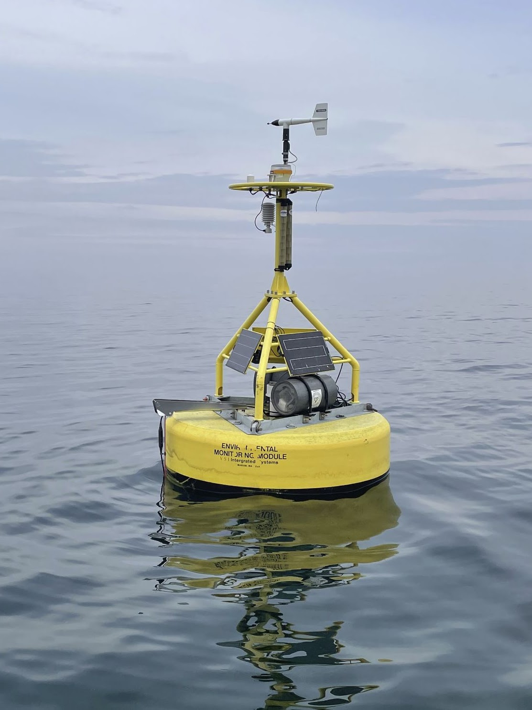

### Near Real Time Environmental Monitoring

The Upstate Freshwater Institute has always had a toe in the world of environmental monitoring including weather and water quality conditions. We often take things one step further by linking monitoring equipment to cellular modems so that the data can be viewed in near real time. Some of these systems produce data that are public facing, and I have become intimately involved with the construction, maintenance, and deployment of them. In fact, it's probably become my primary role when I am out in the field. The work can be particularly challenging due to the harsh nature of mixing electronics with water in unpredictable lake environments.

##### [Lake Ontario](https://www.upstatefreshwater.org/data/lake-ontario)

UFI maintains three monitoring buoys on Lake Ontario, consisting of meteorological (wind, temperature, relative humidity, solar radiation), water quality (temperature, turbidity, dissolved oxygen, turbidity, pH, chlorophyll), and wave (height, direction, period) and current sensors. In addition, each has webcams attached, including one that has an underwater camera (Sodus Point).

{fig-align="center" width="300"}

These stations are monitored almost continuously throughout the year, with the large summer buoys being replaced by a "winter stick" setup for overwinter deployments. The winter season does not include meteorological data, and the surface system consists of a homemade PVC pipe containing the cellular model and antenna. We are continuously evolving the stick system to be rugged against the brutal conditions on Lake Ontario.

Data from the buoys are used by academic, federal, and state researchers for a number of projects related to the health of Lake Ontario. Additionally, the recreating public has increasingly become aware of the data and use it to help make safe decisions on when conditions on the lake are favorable. Currently, funding is provided through Great Lakes Observing System ([GLOS](https://glos.org/)), however, we are always seeking alternative funding sources to keep the buoys "afloat". The underwater camera is currently funded by a grant through the NOAA National Marine Sanctuary Fund. Unfortunately, this fund will be dissolved at the end of 2026. We would like to keep the underwater camera running next season if we can fund it, since we now have the equipment and all the valuable wisdom from the first year of trying to keep the cameras working.

##### [Otisco Lake](https://www.upstatefreshwater.org/data/otisco-lake)

UFI currently hosts a profiling buoy on Otisco Lake, outfitted with a meteorological station and a water quality sonde that collects water quality profiles twice daily. The goal of this [effort](https://www.syracuse.com/outdoors/2026/07/this-finger-lake-supplies-nearly-half-of-central-nys-drinking-water-but-scientists-say-its-aging-at-an-alarming-rate.html)is to collect data in support of future water quality funding for the lake. My role with the buoy is primarily rigging, deployment, and maintenance. The buoy is funded by the Otisco Lake Preservation Association.

##### [Onondaga Lake](https://www.upstatefreshwater.org/data/onondaga-lake)

The flagship UFI monitoring station, the Onondaga Lake buoy, sporting a meteorological station and water quality profiler, has been in place over 30 years. Similar to Otisco, my role is primarly related to physical deployment, retrieval and maintenance tasks.

##### Other

*Skaneateles Lake -*

- Monitoring of turbidity to evaluate levels near municipal water intakes

- Collaboration with SUNY ESF to log water temperature data at various depths

*Tributary Monitoring*

Maintenance of NRT equipment monitoring water quality variables in a number of streams across NYS. Many of these projects support the nine-element process.
