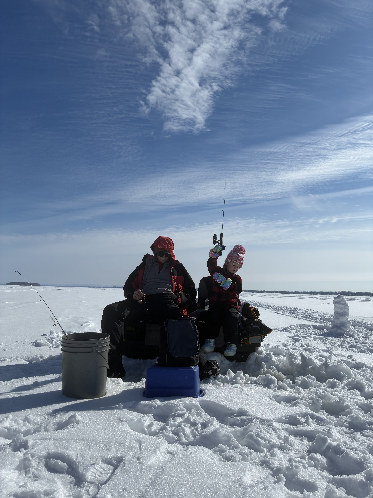
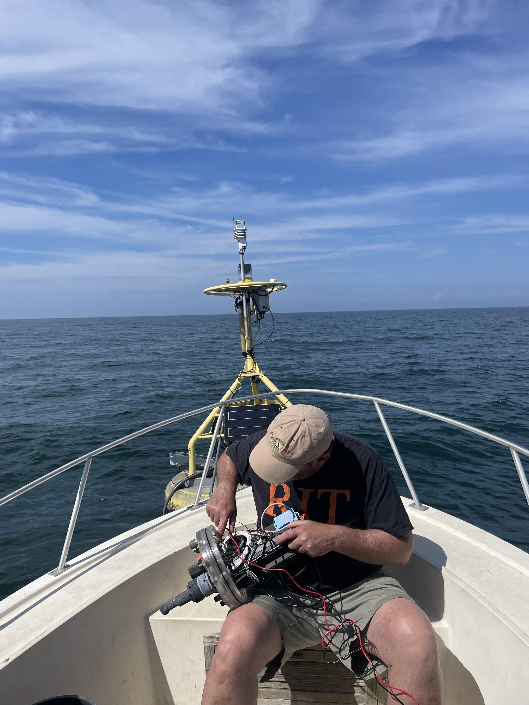

{fig-align="center" width="225"}

### TL;DR

There are currently more than 32,000 followers of the Oneida Lake Diehards Facebook group and more than 17,000 followers of Oneida Lake Anglers. If even a small fraction of the people who enjoy Oneida Lake contributed to the project, we could fund a dedicated monitoring platform on the lake.

The goal is to deploy a buoy for the **2027 ice-free season** that provides publicly available, near-real-time information on **wind, weather, and water temperature**—giving anglers, boaters, swimmers, and other lake users a way to see current conditions before heading to the lake.

The initial cost to get a basic platform operating is estimated at **\$12,000–15,000**, with approximately **\$5,000–7,000 per year** required for deployment, maintenance, and operation.

The exciting part is that we aren't starting from scratch. The Upstate Freshwater Institute (UFI) already has experience operating monitoring buoys, some of the necessary infrastructure is already available, and Cornell has expressed support for the concept.

**The immediate goal isn't to build the ultimate monitoring station. It's to get the first platform on the lake.**

## Why Oneida Lake?

I have an intimate connection with Oneida Lake. My in-laws live on the North Shore, and ever since college I've been visiting the lake to fish, swim, and boat. Now that I live a short drive away, I spend a great deal of my weekends on Oneida.

Like many other people who use the lake, I've also followed along with the [Oneida Lake Diehards](https://www.facebook.com/groups/oneidalakediehards/) and [Oneida Lake Anglers](https://www.facebook.com/groups/298603541000361/) Facebook groups.

One theme that comes up repeatedly is a simple question:

**“What are the conditions on the lake right now?”**

People want to know about wind, waves, and water temperature before making the trip. Shore-based webcams have helped fill that gap over the years, but several have come and gone.

Given my background and my company's experience with on-lake monitoring and near-real-time data systems, I started wondering whether the Oneida Lake community could collectively support something more permanent: **a dedicated monitoring buoy that makes lake conditions publicly available.**

## This isn't starting from scratch

The [Upstate Freshwater Institute](https://www.upstatefreshwater.org/) (UFI) already operates several near-real-time [monitoring buoys](https://www.upstatefreshwater.org/data) that provide publicly available information for people recreating on local waterbodies.

UFI is also currently monitoring four lakes in Allegheny and Harriman State Parks, as well as water quality in a western New York stream for research and regulatory projects.

As a result, we already have much of the infrastructure and expertise needed to operate a monitoring platform. UFI also has several platforms in storage that have been used for previous projects, including physical buoy components and mooring equipment.

That significantly reduces the cost of getting a new platform onto Oneida Lake.

The primary remaining costs are specialized monitoring equipment that is already committed to other projects for 2027, along with the personnel time required to outfit, deploy, maintain, and retrieve the platform.

### Existing Support

**Upstate Freshwater Institute**

My current employer is willing to contribute considerable equipment to offset startup costs, as well as matching some personnel hours as necessary to keep the buoy operating.

**Cornell**

I visited the field station in July 2026 and spoke with Jim Watkins, the acting director. He expressed his support for the project and offered use of the field station docks as a staging area for our operations.

If the project moves forward, Cornell may also be interested in using the platform for research on Oneida Lake.

**Oneida Lake Association**

When I first started working at UFI seven years ago, I had a positive conversation with association leadership about putting a buoy on Oneida Lake. COVID interrupted those plans and the idea was put on the back burner.

I have recently reached out to the association president and hope to build their support for the project as well.

## What would the buoy provide?

{fig-align="center" width="188"}

The initial goal is to provide the information that would be most useful to people using the lake.

### 1. Wind and weather

We use all-in-one meteorological stations from [Young](https://www.youngusa.com/product/responseone-pro/) that measure:

- Wind speed
- Wind direction
- Atmospheric pressure
- Relative humidity
- Air temperature

An internal compass allows the station to accurately determine wind direction. The initial cost estimate is based on purchase of only this station, and the other critical equipment.

### 2. Water temperature

A thermistor chain would provide water temperature at multiple depths. For 2027, we would include a thermistor if funding is sufficient to purchase.

These can be custom ordered depending on how many sensors are needed. A base model with three sensors costs approximately \$1,500, with additional sensors costing approximately \$350 each.

Water temperature would be useful to anglers and other lake users, while also providing valuable information about the lake's seasonal mixing and stratification to students and researchers.

### 3. Wave conditions

Wave height is considerably more expensive to monitor than wind or temperature.

One possibility would be to eventually purchase a [Sofar Spotter Buoy](https://www.sofarocean.com/products/spotter), which is specifically designed to measure wave conditions.

Another possibility would be to develop a wave model that predicts conditions throughout the lake using wind speed, wind direction, and fetch. This could potentially provide wave predictions for the entire lake rather than measurements from a single point.

However, developing a reliable model for Oneida Lake would require significant engineering time, and the lake's relatively shallow depth and numerous islands would make the modeling more complicated. For that reason, a dedicated wave sensor is probably a longer-term goal.

### 4. Webcam

A camera mounted to the buoy would provide another way for people to see lake conditions.

A GoPro and the necessary cables would cost approximately \$750. These systems can be somewhat finicky, but they are relatively inexpensive compared with other monitoring equipment.

Because of data-transmission limitations, we typically record approximately 15 seconds of video at the top of every hour rather than maintaining a continuous live feed.

## What does it cost?

The initial challenge is that **startup costs are considerably higher than the annual cost of keeping the platform operating.**

For a basic platform consisting primarily of a meteorological station, I estimate the initial cost at approximately:

### **\$12,000–15,000 to get the platform on the lake**

That includes equipment that would still need to be purchased, as well as the personnel time required to build and deploy the system.

Some critical equipment is already available through UFI, which helps reduce the total cost.

Additional equipment needed for even a basic platform includes:

- **Datalogger — approximately \$1,600** The datalogger is essentially the brain of the system, collecting and storing the sensor data.

- **Cellular modem — approximately \$200** Allows the buoy to transmit data back to shore.

- **Marine navigation light — approximately \$150**

UFI may have an extra datalogger and/or modem available in 2027, although that depends on the needs of other projects.

Once deployed, I estimate the cost to operate the site at approximately:

### **\$5,000–7,000 per season**

That assumes approximately one day to deploy the buoy, one day to retrieve it at the end of the season, and one or two additional trips for maintenance or repairs, plus time to maintain the webpage interface, and time to clean, store and prep the buoy in the off season. This estimate does not include major purchases of additional sensors.

## Where could this lead?

The meteorological station would be only the beginning.

Once a platform is established on the lake, additional sensors could be added as funding and equipment become available.

UFI already operates or has experience with several types of equipment that could eventually be incorporated into the platform.

### Multiparameter water-quality sonde

These instruments can be configured to measure:

- Water temperature
- Conductivity
- pH
- Dissolved oxygen
- Turbidity
- Chlorophyll
- Cyanobacteria

These are expensive instruments, and I wouldn't expect them to be the first priority for a community-funded project. However, if a platform is already established on Oneida Lake, UFI and/or Cornell could potentially take advantage of it for research when equipment is available.

### Underwater camera

UFI has been developing an underwater camera system on Lake Ontario this season. We've experienced some growing pains, but have had enough success to plan a redeployment next season incorporating what we've learned.

The major challenges are keeping biological growth from obscuring the camera and protecting the camera in an underwater housing. The system currently costs approximately \$5,000–8,000.

An underwater camera on Oneida Lake could eventually provide a fascinating long-term record of conditions beneath the surface.

------------------------------------------------------------------------

## Where would the buoy go?

I would aim to place the buoy in the deepest part of Oneida Lake, offshore of Cleveland, NY.

There are two major reasons for this location.

First, it is approximately mid-lake and in open water, making it a reasonable location for monitoring conditions representative of a large portion of the lake.

Second, the deepest part of the lake is particularly valuable from a scientific perspective. UFI is interested in better understanding the lake's mixing regime, and a deep-water monitoring station would provide an opportunity to measure conditions that aren't captured by shoreline observations.

In particular, temperature and dissolved oxygen measurements could help document seasonal stratification and oxygen depletion in the deepest water.

The location would also provide a useful combination of **public information and scientific value**: the same platform that tells someone how windy it is on the lake could also contribute to a long-term record of how Oneida Lake is changing.

------------------------------------------------------------------------

## The goal for 2027

I don't think we need to build the ultimate Oneida Lake monitoring station on day one.

**If we can get a basic meteorological station onto the lake for the 2027 season, I would consider that a huge success.**

From there, the platform could become something much more valuable over time.

Additional funding could support:

**Weather → Water temperature → Webcam → Waves → Water quality → Research**

The more sensors we can support, the more useful the platform becomes to both the people who enjoy Oneida Lake and the scientists who study it.

------------------------------------------------------------------------

## Could the Oneida Lake community make this happen?

I think it is worth trying.

More than 32,000 people follow Oneida Lake Diehards, and more than 17,000 follow Oneida Lake Anglers. Obviously, not everyone in those groups lives on the lake, uses the lake regularly, or would be interested in supporting a project like this.

But we don't need everyone.

If a few thousand people who fish, boat, swim, or otherwise enjoy Oneida Lake thought this was worthwhile, **a few dollars per person could get the first platform on the water.**

And unlike a one-time event or temporary project, the goal would be to create something that could provide useful information **every ice-free season for years to come.**

For anglers and boaters, that means having better information about conditions before heading out.

For scientists and resource managers, it means another long-term source of environmental data from one of New York's most important recreational lakes.

And for everyone who loves Oneida Lake, it would be a community-funded piece of infrastructure that belongs to all of us.

**That's the idea. Now I'm trying to find out whether the community thinks it's worth making happen.**
