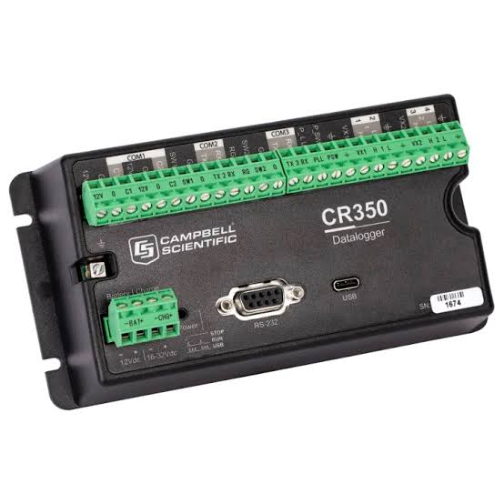

{fig-align="center" width="225"}

### TLDR

There are currently over 32,000 followers of the Oneida Lake Diehards Facebook page, and over 17,000 follow Oneida Lake Anglers. By my logic, if everyone pitched in a dollar over this winter, we could fund a dedicated Oneida Lake monitoring platform that would provide near real time weather and water temperature information that would be publicly available during the ice-free season.

### Overview

I have an intimate connection to Oneida Lake. My in-laws live on the North Shore, and ever since college I've been visiting the lake; fishing, swimming, and boating. Now that I live a short drive away, I spend a great deal of my weekends on Oneida, and like many have followed along on social media with the [Oneida Lake Diehards](https://www.facebook.com/groups/oneidalakediehards/) and [Oneida Lake Anglers](https://www.facebook.com/groups/298603541000361/). A common theme I've noticed are requests for on the water conditions, particularly wind and waves, and water temperature for those looking to make a trip to the lake and not wanting to drive straight into the tempest!

Another commonality I've noticed is the reliance on shore based webcams for viewing lake conditions, and that some of these have come and gone over the years. Given mine and my companies background with on-lake data buoys and near real time applications, it occurred to me that perhaps there would be enough public interest to fund a data buoy on Oneida Lake that would provide on the lake conditions, updated regularly, through crowd sourcing.

The [Upstate Freshwater Institute](https://www.upstatefreshwater.org/) (UFI) currently hosts a number of near real time [data](https://www.upstatefreshwater.org/data) buoys that provide a public service for those looking to recreate on our local waterbodies. In addition, we are currently monitoring four lakes in Alleghany and Harriman State Parks, and water quality in a western NY stream for individual research and regulatory projects. In our storage we have a number of platforms that have been used for past projects which could be outfit with monitoring equipment.

The initial challenge for such a project, is that the startup costs will exceed the annual cost to maintain the system once it has been built. There are two primary costs, initial equipment purchases, and personell hours to outfit and install the buoy. UFI has a stock of some of the critical equipment in our inventory, including the physical buoy and mooring anchors, which would reduce at least the initial cost of equipment purchases. However, there are some pieces of equipment that will need to be purchased regardless (all of our meteorological stations and temperature strings already have homes for 2027), and personnel hours to build the monitoring platform.

### Current Support

Upstate Freshwater Institute -

Cornell

Oneida Lake Association

{width="100"}
