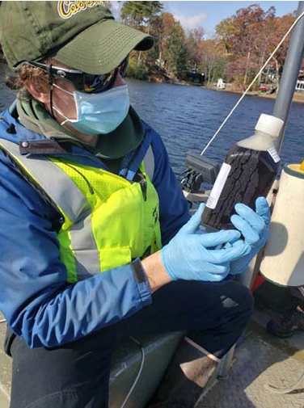
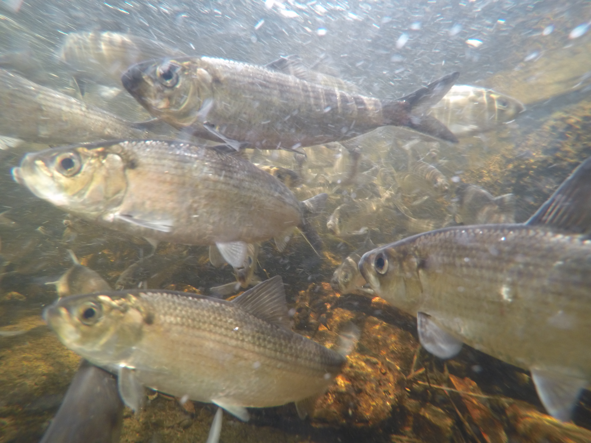

### [EPA Nine-Element Plans](https://extapps.dec.ny.gov/docs/water_pdf/9efaq17.pdf)

I have worked to support a number of watershed nine-element plans during my tenure at UFI. My role has included the estimation of material (nutrient and sediment) loading coming from the land using empirical tools such as [FLUX32](https://www.pca.state.mn.us/business-with-us/water-monitoring-resources) software and the R Package [*loadflex*](https://github.com/DOI-USGS/loadflex), the estimation of dreissenid mussel populations, and watershed modelling with [GWLF-E](https://wikiwatershed.org/knowledge-base/water-quantity-and-quality-models/#7-2-1-the-gwlf-model) (Generalized Watershed Loading Functions - Enhanced).

##### [Owasco Lake](https://www.cayugacounty.gov/1244/Owasco-Lake-Watershed-Nine-Element-Plan) (2019 - 2022)

- Developed material loading estimates using FLUX32 software.

- Watershed land use/land cover assessment using [QGIS](https://qgis.org/).

- Estimated dreissenid mussel biomass, including both zebra and quagga mussels as a single profile with depth using linear regression models.

##### [Skaneateles Lake](https://skaneateles9e.cnyrpdb.org/) (2021 - 2024)

- Developed material loading estimates using FLUX32 software.

- Watershed land use/land cover assessment using [QGIS](https://qgis.org/).

- Estimated quagga mussel biomass as a series of depth profiles for each lake model segment using Bayesian heirarchical modelling.

##### [Oneida Lake](https://www.cnyrpdb.org/oneida9e/) (complete - not released)

- Developed material loading estimates using FLUX32 software.

- Estimated dreissenid mussel biomass using sediment specific depth profiles within a linear modelling framework.

##### [Sandy Creek](https://tughill.org/services/natural-resource-management/sandy-creeks-clean-water-planning/) (complete - not released)

- Calibration and confirmation of GWLF-E watershed models for each of 13 HUC-12 watersheds under study.

- Primary author of modeling report, including sensitivity analysis, model calibration, and management scenario runs reporting.

##### [Otsego Lake (in-progress)](https://cooperstownny.gov/wp-content/uploads/2025/09/2025-08-21_Otsego-Public-Meeting-1_Boards.pdf)

- Data GAP analysis to identify critical data needs for completing the nine-element process.

- Quality Assurance Project Plan (QAPP) development for water quality sampling and dreissenid mussel collection components.

- Developed material loading estimates using the USGS *loadflex* R package.

### Lake Management Plans

Plymouth Reservoir (SUNY Oneonta BFS [Technical Report](https://suny.oneonta.edu/biological-field-station/publications) #32)

- During my first year of the MS program, our cohort collaboratively developed an interim management plan for a small reservoir in central New York.

- Highlights included the creation of a bathymetric map, fisheries survey, and water quality analysis, resulting in recommendations for management actions to protect recreational use of the waterbody.

Butterfield Lake (SUNY Oneonta BFS [Occasional Paper](https://suny.oneonta.edu/biological-field-station/publications) #66)

- My thesis included study of coliform bacteria, fisheries, macrophytes, zooplankton, dreissenid mussels, water quality, and nutrient loading.

- The culmination was a list of recommended actions to protect water quality and best uses of Butterfield Lake.

Ballston Lake

- UFI and EcoLogic LLC collaborated to complete field sampling of this unique lake in Eastern NY. It is a meromictic lake, meaning that a portion of the water column never mixes to the surface.

{fig-align="center" width="223"}

- My roles included field sampling, GIS analysis of the watershed, nutrient loading analysis using available historical data and GWLF-E watershed modeling, and review of report text.

[Hyde Lake](https://www.facebook.com/groups/807750006603216/files/files)

- Polymictic lake in Northen NY with a unique bathymetry.

- My roles included field sampling, GIS analysis of the watershed, compilation and analysis of historical water quality data, and writing and review of the final report.

[Hatch Lake & Bradley Brook Reservoir](https://www.hatchbradleybrook.org/water-quality/ufi-final-report-hbbla-bradley-brook-51724)

- I was the primary investigator who reviewed three decades of historical data on two man-made reservoirs in central NY.

- Using a combination of time series analysis, watershed modeling, GIS analysis, and site visits I was able to provide context to the lake association on recent changes to their waterbodies.

### River Herring Growth

Utilizing data from the Massachusetts Division of Marine Fisheries Age and Growth lab, I evaluated growth patterns among six spawning runs in coastal Massachusetts. This work included the use of back-calculation of length at age using the [RFishBC](https://fishr-core-team.github.io/RFishBC/) package, then fitting those data to von-Bertalanffy growth models. This was the project where I was formally introduced to the use of Bayesian heirarchical modeling with [JAGS](https://mcmc-jags.sourceforge.io/) via the [R2jags](https://github.com/suyusung/r2jags) package.

{fig-align="center" width="300"}

### 
