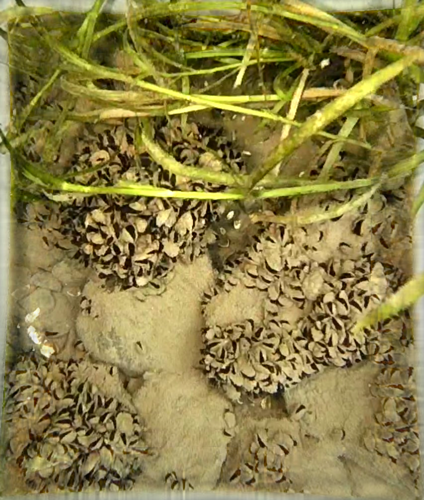
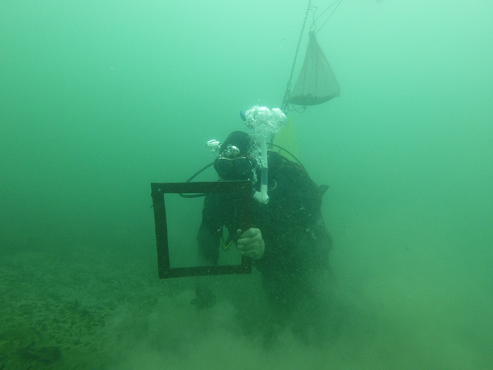

### Dressenid Mussels and Their Impacts on Skaneateles Lake, NY

::: {#fig-side-by-side layout-ncol="2"}
{#fig-musselrocks fig-align="center" width="250"}

{#fig-scubabruce width="393"}
:::

My PhD research centers on two species of benthic bivalves which are invasive to North America; zebra mussels (*Dreissena polymorpha*) and quagga mussels (*Dreissena bugensis*). These mussels are capable of significant alteration of their environment and are known as "ecosystem engineers" for their capacity to alter invaded systems. As filter feeders, dreissenid mussels remove particulates from the water column, and either utilize them as food, or spit them back out, at which point living cells may survive or not. Through these processes, the typical effect of a mussel invasion is increased water clarity and elevated rates of nutrient cycling. However, there are many factors that result in the unique impacts that a waterbody undergoes resulting from invasion such as the size and structure of mussel population, the relative trophic state (how productive a waterbody is), and whether a waterbody is mixed regularly or thermally stratifies seasonally. To evaluate impacts in Skaneateles Lake, my research has three foci:

1.  Methods for rapid assessment of mussel populations using underwater imagery

2.  Assessment of the mussel population in Skaneateles Lake in 2021 and methods used for dreissenid population surveys

3.  Water quality impacts of dreissenid mussels in Skaneateles Lake

### Cazenovia Lake Macrophytes

I've never been much for botany, outside of a keen interest in dendrology and the son of two forestry majors, but since UFI took over the aquatic macrophyte survey on Cazenovia Lake from Bob Johnson at Cornell I have become quite familiar with at least the aquatic plant community of this one NYS lake! We have a paper out for review that explores the use of herbicides to control Eurasian watermilfoil (*Myriophyllum spicatum*) and how the plant community has responded across the 20+ years of survey data.

### Sea Lamprey Migration Phenology

My time in New York has been punctuated by a shift away from fisheries work, but I have been trying for the past few years to launch a project exploring the use of environmental DNA (eDNA) to track the movement of sea lamprey from Lake Ontario tributaries as they make their journey to the lake as juveniles. This has been a historically difficult life period to study because they are hard to trap, requiring facing fyke nets upstream during the fall, during high flows. The use of eDNA could offer an opportunity to monitor these movements without the need for nets, but we need to first determine if the signal is powerful enough compared to its variability to definitively attribute changes in detection magnitude to lamprey movement.
